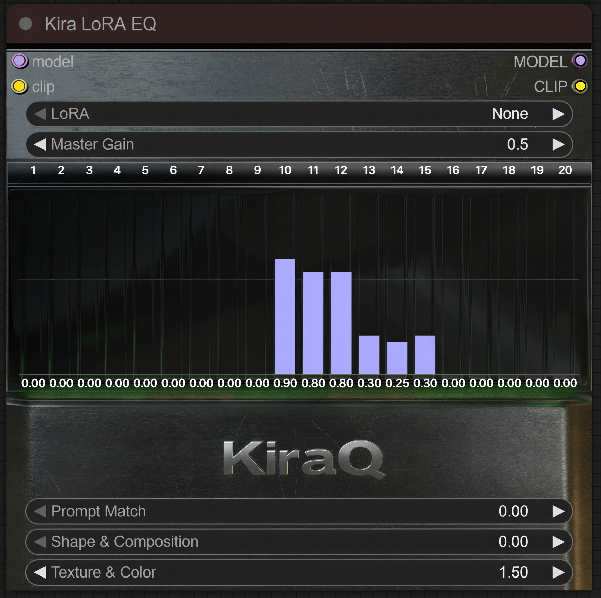

# Kira LoRA EQ

Kira LoRA EQ is a 20-band “equalizer” for a single LoRA in ComfyUI.

Instead of just one strength slider, it slices the LoRA into bands across the network depth, separates cross-attention, self-attention and MLP parts, and lets you rebalance them like you would on a graphic EQ. It runs entirely in memory and does not touch your LoRA file on disk.

## Why this exists

The idea came from a very simple annoyance: character LoRAs tend to leak into the rest of the image.
No LoRA is perfect, and sometimes you want to surgically keep one part of its effect while dialing down the rest.

I'm an audio engineer, so my brain naturally wanted something that feels like a familiar tool: a graphic equalizer.
That is why the node has a custom skin that looks more like studio hardware than a default ComfyUI box.

## What it actually does

On load, the node takes one LoRA and:

- inspects its keys and detects UNet layers  
- classifies LoRA patches into three rough groups:
  - cross-attention (prompt match, text conditioning)
  - self-attention (shape, layout, overall structure)
  - feed-forward / MLP (texture, detail, color)
- maps layers to 20 “bands” along the depth of the network

For Z-Image, bands 1–15 are currently used. Qwen might use 16–20 as well.

From my own use: faces for character LoRAs tend to live roughly in bands 10 to 15–16, and they react the most to the Texture & Color control. 
Your mileage will absolutely vary from LoRA to LoRA.

With Z-Image

With Qwen Edit 2509

## Installation

Put the folder `kira_lora_eq` into your `ComfyUI/custom_nodes` directory so that the structure looks like this:

`ComfyUI/custom_nodes/kira_lora_eq/__init__.py`  
`ComfyUI/custom_nodes/kira_lora_eq/kira_lora_eq.py`  
`ComfyUI/custom_nodes/kira_lora_eq/js/kira_lora_eq_ui.js`  
`ComfyUI/custom_nodes/kira_lora_eq/js/kira_node_skin.png`

If you are using Git, you can clone the repo directly into `custom_nodes`.  
If you downloaded a ZIP, just unpack it so that the `kira_lora_eq` folder ends up there.

Restart ComfyUI after copying the files.

The node will appear as “Kira LoRA EQ” under the `Kira` / `Kira LoRA EQ` category (or wherever your ComfyUI groups custom nodes).

## Notes, limitations and future directions

This is vibe-coded. It was written to solve my own problem and then grew into something shareable.

Things to keep in mind:

- LoRAs are wildly different from each other; band ranges that work for one character may do almost nothing for another  
- the classification into cross/self/MLP is heuristic and based on key names; it is good enough to be useful, not a mathematically perfect decomposition  
- It supports Z-Image and Qwen. Support for other model families and LoRA formats is very much possible but not implemented by me yet

I do not have the capacity right now to actively maintain or support this project. If you find bugs, extend it to other architectures, port the idea somewhere else or redesign the UI, that is awesome. A mention somewhere would be appreciated, but feel free to just run with the concept.

Godspeed, and have fun EQ’ing your LoRAs.

